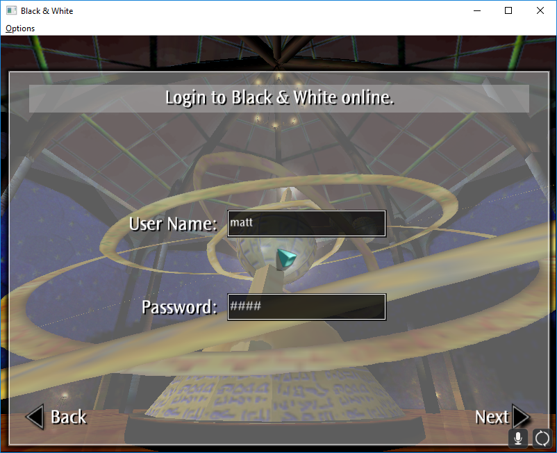
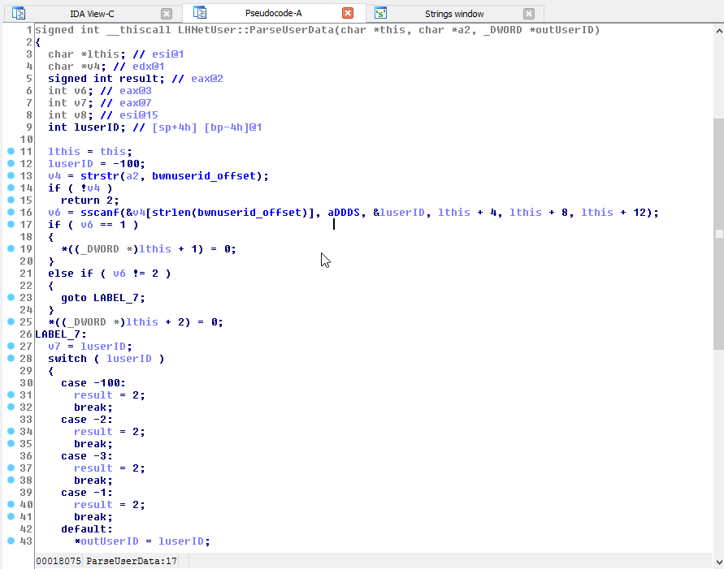
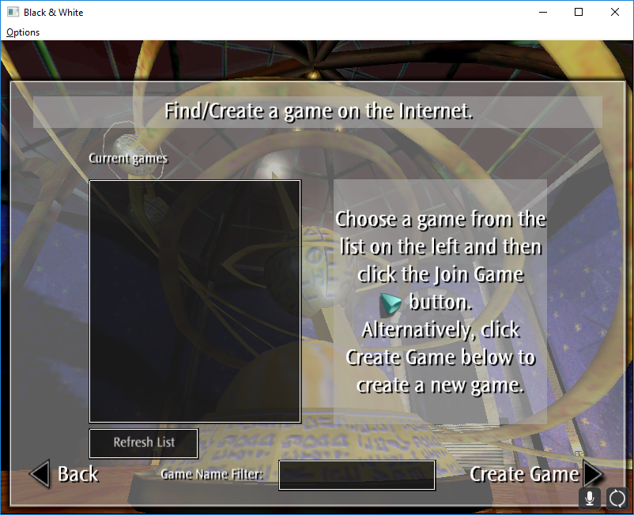
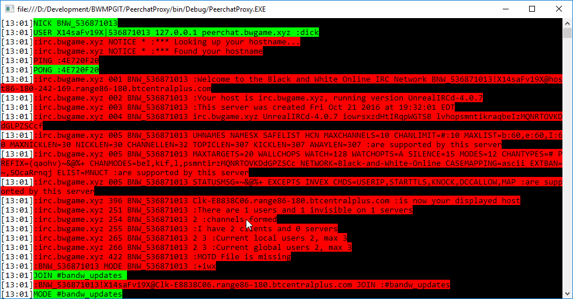
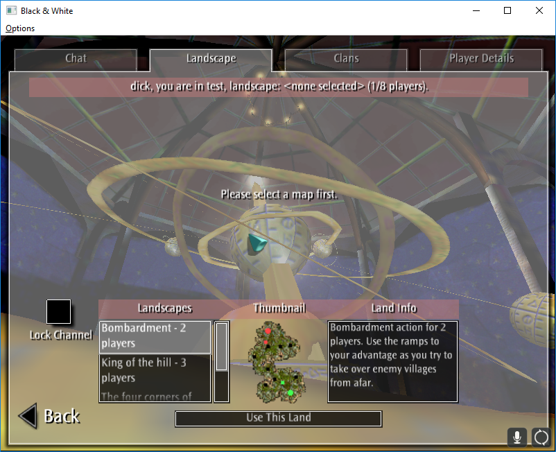

The official servers for Black & White were shut down in 2005, this project is
an attempt to emulate them completely to allow multiplayer connectivity across
the internet for anyone and to offer the same services provided between 2001-2005
by bwgame.com.

*This post is a reflection write up of my GitHub repository bw1-mp that I worked
on during October 2016. We figure out how to mimic the bwgame.com servers to
allow a user to login and lobby, the next step would be to replicate GameSpy.  
You can find the source code [here](https://github.com/handsomematt/bw1-mp).*

### Starting with the login request

Our first target to attack is the login server, we need to imitate the expected
values in order for our game client to get anywhere near the online process.
When you first start the multiplayer client you are greeted with a login screen
asking for your username and password; when the game first came out you were
required to register your username and password with your CD-Key online.



Using Wireshark we can monitor all network traffic the game attempts to send
to the server, however as there is no server we can not determine what the
client expects as a response, so we will require other methods such as guess
work and disassembling the game's binary.

Submitting the form with the username and password set to `matt` `matt` will
generate a HTTP GET request to `login.bwgame.com:80` with the username and
password as query strings, knowing this we can easily create a simple
authentication system - now let's work on the response.

```
GET /login/?username=matt&userpassword=matt
```

### Responding to the login request

Like I said before, this isn't as easy because we don't have any packet dumps
from the actual server to work on. We're going to need to open our disassembly of
the game and see how the client handles the response data to create a response.
Responding any data not in the correct format results in an incorrect password dialog.



Following some disassembly we find that the response data from the server is
parsed like so: `bnwuserid:%d %d %d %s`

We can immediately tell the first digit is a unique user id, the rest of the
values are currently unknown and don't seem to effect anything noticeable.
We can look into them some other time.

Sending a response of `bnwuserid:1 1 1 hello` is enough to get us past the login
and onto the next step.

### GET ConditionTemplate.txt

Firstly, there is a very simple GET request made to
`storage.bwgame.com/bwmaps/ConditionTemplate.txt` by the game client.
`ConditionTemplate.txt` - is a very basic CSV  file format and luckily a copy
is included in the game itself, this file contains the win conditions for
all the different multiplayer maps.

We simply respond to the request with our copy of the file, no obfuscation or
encoding on this. Without this the game client refuses to go any further.

### db.bwgame.com

Our next HTTP request is odd, a HTTP PUT request is made to `db.bwgame.com/query`
with the following query string:

```
domode=1&
dbflags=14&
bwversion=140&
bwlanguage=UK&
uid=1&
uname=matt&
upass=pass&
query=HPFFEGFCCPIKEOFDCMFIFBEJCJABCNLM
```

Most of that data is self explanatory, except `dbflags` and `query`. This one
stumped me for quite a while but basically `dbflags` is the plaintext length of
the unencoded and unobfuscated `query` parameter.

### Lionhead's Base 26 web encoding

Looking into the `query` parameter, Lionhead decided to use their own base 26
[A-Z] web encoding, so for every 2 characters just 1 full byte is represented.

All the encoding is, is simply taking the bottom 4 bits [0-15] and the top 4 bits
[also 0-15] and adding 65 (ASCII A) to the value. We can work out the encoding this way:

| In   | >>4 (L) | &0xF (H) | +65 (L) | +65 (H) | ASCII (L) | ASCII (H) |
| ---- | ------- | -------- | ------- | ------- | --------- | --------- |
| 0xFF | 0x0F    | 0x0F     | 0x50    | 0x50    | P         | P         |
| 0x64 | 0x06    | 0x04     | 0x47    | 0x45    | G         | E         |
| 0x03 | 0x00    | 0x03     | 0x41    | 0x44    | A         | D         |

*We simply take each hex digit, and add 0x41 (65 dec) to it.*

If we want to decode an encoded string we simply do the opposite:
1. turn both characters into their numerical ASCII integer
2. negate 0x41 (65 dec) from each integer
3. bit shift the first/lower integer left by 4 bits
4. add them together

| In (L) | In (H) | -65 (L) | -65 (H) | Out  |
| ------ | ------ | ------- | ------- | ---- |
| P      | P      | 0x0F    | 0x0F    | 0xFF |
| G      | E      | 0x06    | 0x04    | 0x64 |
| A      | D      | 0x00    | 0x03    | 0x03 |

Using this we can now decode our query string.... partly.

### Tiny Encryption on query strings

Using our newly created `LHWebDecode` procedure on the query string the client
sends the server `HPFFEGFCCPIKEOFDCMFIFBEJCJABCNLM`, we don't get a neat ASCII
string like I was expecting, we get a jumbled array with many unprintable
characters. Diving into the disassembly some more, the reason they encode the
query string in the first place is because they first obfuscate it.

The encryption would be difficult to figure out if it wasn't for the constant
`0x9E3779B9` or in decimal `2654435769` which is equal to `232 ÷ φ`.
This is a common constant in Fibonacci hashing.

From the usage of Fibonacci hashing and the usage of a 128-bit key we can ascertain
that the encryption used is a derivative of [TEA (Tiny Encryption Algorithm)](https://en.wikipedia.org/wiki/Tiny_Encryption_Algorithm).
Most likely it uses `XXTEA` an improved upon version fixing several weaknesses
in the original algorithm. You can see below a diagram of how it works:


**Luckily for us, *the keys are included in the game client*.**  
Encryption cracked, you can see the completed functions for encryption and
decryption [here](https://github.com/HandsomeMatt/bw1-mp/blob/master/BWMP/Lionhead.cs#L92).  

Now we can run our original query string sent by the game client through our
base-26 conversion and then our TEA decryption:

`HPFFEGFCCPIKEOFDCMFIFBEJCJABCNLM` -> `BWMAPS_GETLIST`

### Constructing our query response


After searching the disassembly for `BWMAPS_GETLIST` it became easy to see how
the game client parsed the response; it would *search* the response string for:

* `[rows]:%d` number of rows returned
* `[columns]:%d` number of columns per row
* `[totalcolumns]:%d` basically rows * columns

We can ascertain that the client expects a table of data in the response, the
client loops through each byte of the response looking for the byte values
`0x02` (`ASCII STX`) and `0x03` (`ASCII ETX`): start of text and end of text.
For each pair of these, the data in between them is treated as the column data.

Let's construct our response's map table from the following:

| ID | Name                                 | File     | Players | Hostname              | Download Folder |
|:--:| ------------------------------------ | -------- |:-------:| --------------------- | --------------- |
| 1  | Bombardment - 2 players              | mpm_2p_1 | 2       | storage.bwgame.xyz:80 | /bwmaps/        |
| 2  | King of the hill - 3 players         | mpm_3p_1 | 3       | storage.bwgame.xyz:80 | /bwmaps/        |
| 3  | The four corners of Eden - 4 players | mpm_4p_1 | 4       | storage.bwgame.xyz:80 | /bwmaps/        |

**The column headers are assumed from later work disassembiling the game,
hostname & download folder are used by the client to download maps they do not
have.**

First let's make our data descriptions: `[rows]:3[columns]:6[totalcolumns]:18` -
we obviously have 3 rows, each with 6 cols, so we have a total of 18 columns.
Now we loop the data and create our full data string from that:

```
\0x21\0x3\0x2Bombardment - 2 players\0x3\0x2mpm_2p_1\0x3\0x22\0x3\0x2storage.bwgame.xyz:80\0x3\0x2/bwmaps/\0x3\0x22\0x3\0x2King of the hill - 3 players\0x3\0x2mpm_3p_1\0x3\0x23\0x3\0x2storage.bwgame.xyz:80\0x3\0x2/bwmaps/\0x3\0x23\0x3\0x2The four corners of Eden - 4 players\0x3\0x2mpm_4p_1\0x3\0x24\0x3\0x2storage.bwgame.xyz:80\0x3\0x2/bwmaps/\0x3[rows]:3[columns]:6[totalcolumns]:18
```

Responding to the original query request with the above data string, our client
accepts the data as valid and continue through the process.

### Another query: BWGETPEERCHAT

After our map list has been downloaded by the client, the client sends the database
server another request to `/query/`, thanks to our previous efforts we can instantly
decode and decrypt the query string as `BWGETPEERCHAT`. A quick search through
our disassembly will reveal the response is simply parsed as a 1x1 table containing
a host name and port like so:

| Hostname : Port          |
| ------------------------ |
| peerchat.bwgame.com:6667 |

*The tables don't have column headers, I just add those to make data representation easier to understand.*

After our client receives the string `\0x2peerchat.bwgame.com:6667\0x3[rows]:1[columns]:1[totalcolumns]:1`
the game client will open a TCP connection directly to the given hostname + port.

### GameSpy's Peerchat

Before we examine the TCP connection stream anymore, it's important to know what
Peerchat is first; the original Peerchat server was written by GameSpy and used
to be hosted on `peerchat.gamespy.com` - until it was shutdown in 2014 making
hundreds of games multiplayer modes completely useless. It enabled a simple way
for game developers to create lobby based game systems enabled with cd-key
authentication and encryption.

PeerChat is also however **just a classical IRC server** which uses a very simple
encryption - and *Black & White doesn't even use the encryption*.

### Peerchat Handshake

If we go back to our TCP connection stream now and examine it, the client makes
the first move by sending a simple `USRIP\r\n` command. Luckily
[aluigi](https://twitter.com/luigi_auriemma) has already reverse-engineered the
Peerchat protocol and we can see the response we have to make.

`:s 302  :=+@0.0.0.0\r\n`

As soon as we send this back, the client begins sending regular IRC commands:

```
NICK BNW_536871013
USER X14saFv19X|536871013 127.0.0.1 peerchat.bwgame.xyz :matt
```

Great. Let's proxy them to a real IRC server now, I set a basic one up using
unrealircd running on classical IRC mode since the game is from 2001.
And if we proxy the responses back to the client we get past the handshake phase
into the current game list:





### Peerchat Notes

* The multiplayer pretty much entirely works over the Peerchat/IRC protocol - you
can create games which basically creates an IRC channel `#GSP!bandw!X14saFv19X`
where the name partially matches your encoded user credentials. Rooms are passworded,
locked etc.. using default IRC modes and the creator is channel OP.

* `NICK BNW_536871013` - The argument is basically the UID we provide in login but with the bitwise operators `UID & 0x1FFFFFFF | 0x20000000` applied making the value a much higher integer.
* `USER X14saFv19X|536871013 127.0.0.1 peerchat.bwgame.xyz :matt` - The first argument is our users encoded IP address and their bit operated UID (let's call it GameSpy ID), 2nd arg: their hostname (always 127.0.0.1?), 3rd: the server name, 4th: b&w username. We'll look more into encoded IP addresses later.

### Current game list:

```
JOIN #bandw_updates
PART #bandw_updates
```

Whenever the `Refresh List` button is pressed the client sends a join, waits (more like hangs whilst it waits for a response) and then leaves the channel. This happens when
the client first logs in too. It is unclear right now what the game expects as a response but we will look into it later.

Logging multiple clients into the game works, but they can not see each other games in the list yet.

### Footnote

Emulating bwgame.com servers is pretty much done now, all we need is a GameSpy
peerchat emulator and we would have a complete lobby functionality.
All code is [publically available on GitHub](https://github.com/HandsomeMatt/bw1-mp).
